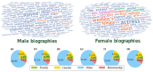
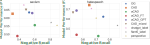

```{r xaringan-themer, include=FALSE, warning=FALSE}
#This block contains the theme configuration for the CSS lab slides style
library(xaringanthemer)
library(showtext)
style_mono_accent(
  base_color = "#5c5c5c",
  text_font_size = "1.5rem",
  header_font_google = google_font("Arial"),
  text_font_google   = google_font("Arial", "300", "300i"),
  code_font_google   = google_font("Fira Mono")
)
```

```{r setup, include=FALSE}
options(htmltools.dir.version = FALSE)
```


layout: true
<div class="my-footer"><span>David Garcia - Analyzing gender inequality in digital traces and the technologies they power</span></div> 

---

background-image: url(figures/AboutUS.svg)
background-size: 98%


---

layout: true
<div class="my-footer"><span><a href="https://epjdatascience.springeropen.com/articles/10.1140/epjds/s13688-016-0066-4"> Women Through the Glass Ceiling: Gender Asymmetries in Wikipedia. Claudia Wagner, Eduardo Graells-Garrido, David Garcia, Filippo Menczer. EPJ Data Science (2016)  </a></span></div> 


---

# Gender bias in digital traces: Wikipedia


.pull-left[
- Fraction of male editors in Wikipedia: 91% (2011)
- 5th most visited site in number of visitors (2023)
- **Fundational dataset for AI**
  - **"The Pile" contains 20GB of Wikipedia text**
]

.pull-right[
.center[]
]


<div style="font-size:22pt"><span>
<a href="https://ojs.aaai.org/index.php/ICWSM/article/view/14628/14477"> It's a Man's Wikipedia? Assessing Gender Inequality in an Online Encyclopedia. Claudia Wagner, David Garcia, Mohsen Jadidi, Markus Strohmaier. ICWSM (2015)  </a>
</span></div>  
<br> <div style="font-size:22pt"><span>
<a href="https://epjdatascience.springeropen.com/articles/10.1140/epjds/s13688-016-0066-4"> Women Through the Glass Ceiling: Gender Asymmetries in Wikipedia. Claudia Wagner, Eduardo Graells-Garrido, David Garcia, Filippo Menczer. EPJ Data Science (2016)  </a>
</span></div>  

---

# Gender in Wikipedia biographies

**We analyzed 1 Million biographies in the top 20 Wikipedia languages**

.center[]

---

# Words predicting gender in Wikipedia


---

layout: true
<div class="my-footer"><span><a href="https://www.pnas.org/doi/10.1073/pnas.1717781115"> Analyzing gender inequality through large-scale Facebook advertising data. D. Garcia, Y. Kassa, A. Cuevas, M. Cebrian, E. Moro, I. Rahwan, R. Cuevas. PNAS (2018)  </a></span></div> 

---

# Gender bias in digital traces: Facebook


**Facebook Gender Divide (FGD) as measured with FB advertisement data**

---

# The FGD reflects offline inequality


- Regression model of FGD as a function of WEF gender inequality indices
- FGD is a sign of education gender inequality

---

# When moderation silences minorities

- AI is used automatically in moderation to detect hateful and sexist text
- **Do models label non-harmful use of identity and slur terms as harmful?**
- Examples of false positives in Hatecheck:
  - Reported and quoted use:  
      *“I was called a [SLUR] so many times growing up”*
  - Non-hate expressed using negated hateful statement:  
      *“We shouldn’t let [IDENTITY] suffer”*
  - Denouncements of hate that quote it:  
      *“Statements like ‘[IDENTITY] are scum’ deeply hurtful.”*
  - Denouncements of hate that make direct reference to it:  
      *“You have to stop calling [IDENTITY] disgusting.” *

**Negative Recall of a model**: the fraction of correctly identified negative cases that use identity terms and slurs in a non-hateful way

---
## Trade offs between performance and neg recall



- ChatGPT has high performance but low neg recall: silencing risk
- Perspective has worse performance and neg recall than open source models
- Open source models (BERT, FLANT5) have better negative recall
<br>.center[**To prevent silencing minorities, we need more than performance**]


---

# Summary

### Computational Social Science and AI uses digital traces

### Digital traces can capture gender biases:

- **Wikipedia biographies of women contain gender stereotypes**
- **Facebook data follows gender inequality across countries**
  
### AI moderation can silence minorities with false positives
-  **Open source models do better despite lower performance**

.center[**More at: [www.dgarcia.eu](https://dgarcia.eu)**]
.center[**More at: [Bluesky:@dgarcia.eu](https://bsky.app/profile/dgarcia.bsky.social)**]


